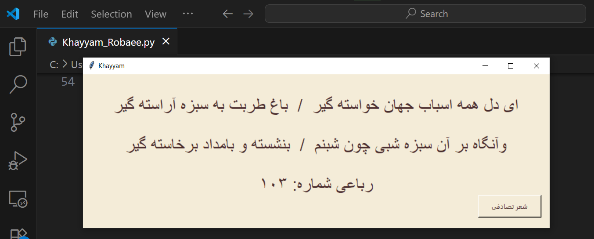

# Khayyam Robaee

یک برنامه دسکتاپ ساده که با python3.12.8 و tkinter8.6.15 نوشته شده و به صورت رندوم یک شعر از خیام در سایت گنجور نمایش میدهد

----------

ویژگی ها :

    دریافت رباعی تصادفی خیام
    رابط کاربری ساده و زیبا با tkinter
    مدیریت خطا در صورت قطع اینترنت و یا تغییر ساختار سایت

----------

----------
کتابخانه های مورد نیاز:
    
    beautifulsoup4
    requests
    tkinter
    random

